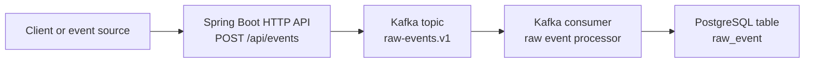

# Architecture

## System Overview

`agentic-dataops-platform` is a production-style backend platform for data-intensive agentic AI operations. The architecture starts with a reliable event ingestion backbone before adding retrieval, agent workflows, or automated root cause analysis.

The project is intentionally incremental. Week 1 focuses on moving operational events from an HTTP API into Kafka and then into PostgreSQL. Later phases will use that persisted event history as the foundation for incident context, retrieval, and agentic analysis.

## Current Phase

Current phase: Week 1 - Event ingestion backbone.

The Week 1 target flow is:

```text
HTTP API -> Kafka -> Consumer -> PostgreSQL
```

The first working system should prove this path:

```text
POST /api/events
    -> raw-events.v1
    -> raw event consumer
    -> raw_event
```

## Week 1 Architecture



The intended responsibilities are:

- HTTP API: accept versioned raw event envelopes.
- Kafka: provide the append-style ingestion log and decouple request handling from persistence.
- Consumer: read raw events from Kafka and persist them.
- PostgreSQL: store durable raw events for later query, replay, and incident workflows.

Week 1 should stay intentionally simple:

- One backend application.
- One Kafka topic for raw events: `raw-events.v1`.
- One PostgreSQL table for raw events: `raw_event`.
- Documentation of reliability and schema evolution choices as they are made.

No backend service, Kafka topic configuration, consumer, database schema, or Docker Compose setup has been implemented yet.

## Future Phases

Future phases are part of the project direction, but they are not implemented yet.

Phase 2 will strengthen data-intensive reliability patterns inspired by Designing Data-Intensive Applications (DDIA), including idempotency, replay, schema evolution, and consistency trade-offs.

Phase 3 will add anomaly and incident context APIs over stored operational data. This prepares the project for retrieval without introducing agent workflows too early.

Phase 4 will add RAG context retrieval over runbooks, incident memory, and operational documents.

Phase 5 will add CrewAI-based root cause analysis agents that use the platform's stored events and retrieved context.

Phase 6 will add ReAct-style tool usage and self-reflection / critic loops for evidence checking and confidence calibration.

Phase 7 will focus on production hardening, including tracing, metrics, evaluation data, fallback behavior, and security notes.

These later phases should be added only after the event ingestion backbone and data reliability foundation are in place.
