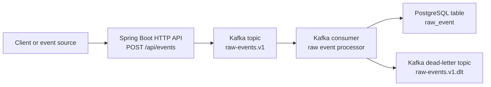

# Architecture

## System Overview

`agentic-dataops-platform` is a production-style backend platform for data-intensive agentic AI operations. The architecture starts with a reliable event ingestion backbone before adding retrieval, agent workflows, or automated root cause analysis.

The project is intentionally incremental. The completed ingestion and reliability phases move operational events from an HTTP API into Kafka and then into PostgreSQL with explicit idempotency, retry, dead-letter, and poison-message behavior. Later phases will use that persisted event history as the foundation for derived read models, incident context, retrieval, and agentic analysis.

## Current Phase

Current phase: Derived data / CQRS read model.

The implemented ingestion flow is:

```text
HTTP API -> Kafka -> Consumer -> PostgreSQL
```

The working system proves this path:

```text
POST /api/events
    -> raw-events.v1
    -> raw event consumer
    -> raw_event
```

## Implemented Ingestion Architecture



The intended responsibilities are:

- HTTP API: accept versioned raw event envelopes.
- Kafka: provide the append-style ingestion log and decouple request handling from persistence.
- Consumer: read raw events from Kafka, persist valid events, skip duplicates, retry transient failures, and route failed raw events to the DLT.
- PostgreSQL: store durable raw events for later query, replay, and incident workflows.

Week 1 stays intentionally simple:

- One backend application (Kotlin/Spring Boot).
- One Kafka topic for raw events: `raw-events.v1`.
- One PostgreSQL table for raw events: `raw_event`.
- Flyway for versioned schema management.
- Documentation of reliability, local observability, and schema evolution choices as they are made.

## Implementation Status

Implemented components:

- `POST /api/events` — accepts versioned `IngestEventRequest`, returns `202 Accepted`.
- `IngestionProducer` — publishes `RawEvent` envelope to `raw-events.v1` (keyed by `tenantId`).
- `RawEventConsumer` — Kafka listener that persists events to `raw_event`.
- `raw_event` table — stores full envelope with `UNIQUE` constraint on `event_id` for idempotency.
- `raw-events.v1.dlt` — retains failed `RawEvent` records after retry exhaustion or non-retryable classification.
- Consumer retry configuration — bounded retry for retryable listener failures.
- Error classification — distinguishes non-retryable poison messages from retryable infrastructure/persistence failures.
- Failure-mode tests — cover duplicate events, retry success, retry exhaustion, DLT routing, and poison-message handling.
- Docker Compose — local Kafka (KRaft), PostgreSQL, Kafka UI, Prometheus, and Grafana.

The next architecture step is a derived data / CQRS read model over `raw_event`, so query paths can evolve without overloading the raw event table or introducing AI layers prematurely.

## Future Phases

Future phases are part of the project direction, but they are not implemented yet.

Phase 2 strengthened observability and local baseline ingestion with Spring Actuator, Prometheus, Grafana, k6, and MDC correlation.

Phase 3 completed ingestion reliability and failure handling with idempotency, retry, DLT routing, poison-message classification, and failure-mode tests.

The next phase will add a derived data / CQRS read model over stored operational events. This prepares the project for query-oriented incident context without introducing agent workflows too early.

Later phases will add RAG context retrieval over runbooks, incident memory, and operational documents.

Later phases will add CrewAI-based root cause analysis agents that use the platform's stored events and retrieved context.

Later phases will add ReAct-style tool usage and self-reflection / critic loops for evidence checking and confidence calibration.

Phase 7 will focus on production hardening, including tracing, metrics, evaluation data, fallback behavior, and security notes.

These later phases should be added only after the event ingestion backbone and data reliability foundation are in place.
